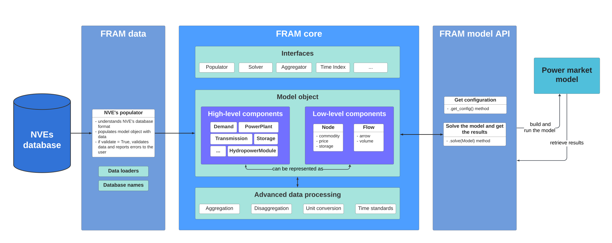

# How FRAM works

The main component of FRAM is the [**core model**](why_core_model.md) in  the [FRAM core]({{ framlinks.core }})  package, which creates a Python object **Model()** that holds the data from the database. The data in the Model object is transformed depending on what is required by the given power market model. 

Data is imported from the database using a **Populator** class in the [FRAM data]({{ framlinks.data }}){:target="_blank"} package.  

Data is sent to a power market model through the FRAM **solver interface** defined in [FRAM core]({{ framlinks.core }}){:target="_blank"} package. The current release has an implementation of a solver in [FRAM JulES]({{ framlinks.julesAPI }}){:target="_blank"}.

### Architecture of FRAM

The Model object contains high-level **components** (Python objects) that hold the data about specific elements in the power system, for example power plants, demand, transmission etc. [High-level components can be represented as low-level components](why_components.md)  - flows and nodes. For example, demand is a flow with an arrow towards a node, while production is a flow with an arrow away from a node.

Different kinds of **nodes** can be defined - emission nodes, power nodes, fuel nodes etc. In this way, the system supports modelling not only the power market, but also other adjacent markets - the heating market, emission market, gas market, etc.

Data in the core model can be easily **manipulated** - aggregated, disaggregated and converted, with respect to different units and time resolution, etc. This is how data can be staged for a given energy marked model run.

Through the solver interface, data is sent to the power market model, and **results** are sent back from the solved model to core model. Core model has fields for 'feeding in' results from different models. For example, a Node() object has a field where you can set the price from a solved model. Model results can then also be manipulated, through aggregation and disaggregation, etc., which simplifies comparison between models.

For more details about the core model, see [FRAM core]({{ framlinks.core }}){:target="_blank"}.

For more details about the database and data package, see [FRAM data]({{ framlinks.data }}){:target="_blank"}.

For more information about the JulES API, see [FRAM JulES]({{ framlinks.julesAPI }}){:target="_blank"}.

