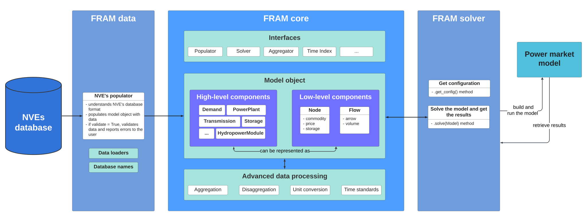

# How FRAM works

*We are still working on this description, more information will come soon.*

The main component of FRAM is the **core model** that creates a python object **Model()** that holds the data from the database. Data in the model object is transformed depending on what is required by the given power market model. Data is imported from the database using **populator** class in FRAM data package.

_Architecture of FRAM_

The model object contains high-level **components** (python objects) that hold the data about a specific element in the power system, for example power plants, demand, transmission etc. High-level components can be represented as low-level components - flows and nodes. For example, demand is a node with a flow arrow towards the node, while production is a node with flow arrow away from the node.

Different kinds of **nodes** can be defined - emission nodes, power nodes, fuel nodes etc. In this way the system supports modelling not only power market but also other adjacent markets - heat market, emission market, gas market etc.

Data in the core model can be easily **manipulated** - aggregated, disaggregated, converted with respect to different units and time resolution, etc. This is how data can be staged for a given energy marked model run.

For more details about the core model, see [FRAM core]({{ framlinks.core }}){:target="_blank"}.

For more details about the database and data package, see [FRAM data]({{ framlinks.data }}){:target="_blank"}.

For more information about the JulES API, see [FRAM JuLES]({{ juleslinks.jules }}){:target="_blank"}.

