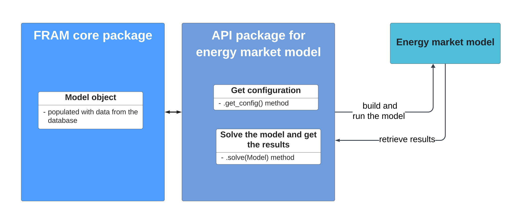

# How to connect a new energy market model?
To connect a new energy market model to FRAM you need to create an API for the model - a Python package that will connect the core model to the optimisation algorithm in the energy market model.

Use JulES API package (fram-jules) from our [simple demo]({{ framlinks.demo }}){:target="_blank"} as an example. 

Energy market model is normaly a third-party software that contains an algorithm for solving the market optimisation problem, as well as the model input data and output data in some format. The algorithm for solving the optimisation problem may be implemneted in different languages, e.g. GAMS, Julia, Matlab etc. Many models have their own interfaces for handling the input and the output data. 

To connect the model to FRAM you have to create an API package that understands the core model, is able to get data from it, send it to the 3-rd party software and start the optimisation. It will also have to read the results of the optimisation and send them back to the core model. The two most important methods you have to implement are **get_config** and **solve** methods. Interfaces for them can be found in [FRAM core]({{ framlinks.core }}){:target="_blank"}:

- framcore.solvers.Solver.py
- framcore.solvers.SolverConfig.py

To be a Solver, the object must inherit from Solver() and have methods *.get_config()* and *._solve()* (method *.solve()* must depend on method *._solve()*).

What is behind these methods may vary widely from model to model, depending on how the optimisation model was set up by its developers. For most optimisation models, the Solver-method will have to create all necessary input files in some format (e.g. csv, h5 or txt) and call upon the optimisation software (e.g. GAMS solve or juliacall). It will also have to read output files in some format (e.g. txt) and put data back into the Model() object.  

Note that in many cases it may be easier to pass-by the original user interface of the energy market model to avoid redundant steps. It may for example be easier and faster to create input files and call upon the optimisation software directly instead of calling upon some functions in the user interface that will afterwards perform the same operations. 

## Do I need to add something to the core model?

If the energy market model you want to connect has data that is not yet supported in the core model, than one of alternatives is to create new components in the core model (og reuse the existing components if possible). If you create new components, than you also have to send new data from the database to the core model, i.e. extend the Populator and add new data validation steps. The core model is constantly under development, and we are constantly adding support for new components. If you have added new components that may be useful for others, [tell us about it](mailto:fram@nve.no) so we can extend the core model with your components. 

Another alternative is to add model-specific input via SolverConfig. Than this input will only be relevant for this specific model and other energy market models will not be able to make use of it. An example can be model-specific calibration or model-specific factors that no other models use. 

## How to send data from the core model to the Solver?
Some models operate with "concrete" data models where input data is based on "real-world" definitions (thermal, demand, transmission etc). These models can use existing high-level components in the core model directly. For example, if your model needs a smart house component, try to define it using existing components demand, battery and solar plant. 

You can also define your own components - in this case you have to update the Populator so that it knows about the new components. 

Other models have more "abstract" data models, like nodes and flows. FRAM core model supports these models as well because all high-level components can be decomponsed into low-level, more abstract components **flow** and **node**. These are the most basic components in the core model.

Models with "concrete" data models can also use low-level components, though it may be not intuitive in the start. This approach can give some significant advantages where you will get much more "clean code" and avoid a lot of duplicate code. See our examples with JulES model to understand better how to flow and node components are used.

 
 
 

