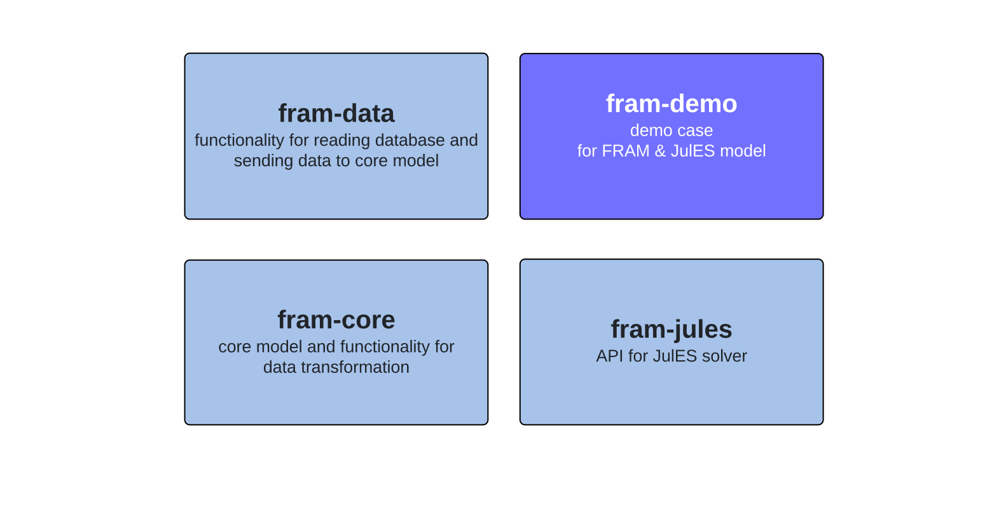

# What is FRAM?

FRAM is an open-source modelling framework developed by the [Norwegian Water Resources and Energy Directorate (NVE)](https://www.nve.no/english/){:target="_blank"} that allows you to build and run different energy market models and compare them to each other. 

If you previously saw a FRAM presentation or want to get started, you might want to read about [installation](installation_and_demo.md) or go directly to [FRAM demo on GitHub]({{ framlinks.demo }}){:target="_blank"}. 

Here is a [video demonstration of the FRAM demo with the JulES model]({{ framlinks.video }}){:target="_blank"}.

The version of FRAM that is currently published is a Minimum Viable Product, meaning that it has minimum functionality to run a simple power market model. We are working on adding more features.  

## Architecture of FRAM

FRAM gets data from a common model-neutral database and efficiently performs all necessary data transformations and operations needed to build a model, solve it, and get the results.

FRAM simplifies working with models for analysts and reduces the time needed to build and run power market models and get results. It ensures consistency between models, as they are created from the same dataset. Each model is only integrated into the model framework once, and then the analysts can run models and scenarios, sequentially or in parallel, adjusting the workflow depending on the specific analysis.

## Key features

- **Universal and model independent design** - you can connect any power market model to FRAM. The current release includes an API and tutorials for running the open-source power market model [JulES]({{ juleslinks.jules }}){:target="_blank"}.
- **Innovative data processing system** - FRAM can efficiently perform complex operations like aggregation, disaggregation, and can handle different units and time dimensions.
- **Fast and efficient** - data processing in FRAM is designed to be fast and have efficient memory use.
- **Modular and flexible** - you can extend the core model or replace components with your own.

## FRAM Packages

FRAM consists of several Python packages:

We suggest installing or downloading [FRAM demo on GitHub]({{ framlinks.demo }}){:target="_blank"} to explore FRAM. It will install all other packages automatically for you.

You will find **documentation for each package** following these links:

- [FRAM core]({{ framlinks.core }}){:target="_blank"}
- [FRAM data]({{ framlinks.data }}){:target="_blank"}
- [FRAM JulES]({{ framlinks.julesAPI }}){:target="_blank"}
- [FRAM demo]({{ framlinks.demodocs }}){:target="_blank"}
