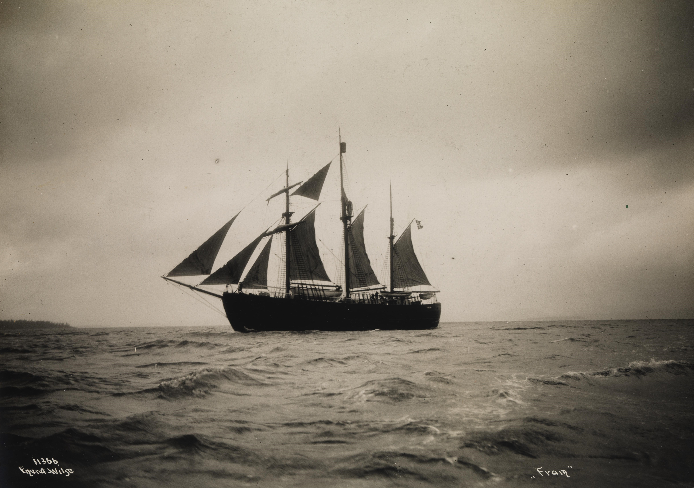

# Why it is called FRAM
FRAM is derived from the English word "framework". But it is also the name of the Norwegian ship that due to its innovative design managed to sail farthest towards the North Pole and the South Pole than any other ship did before.

    "What, however, may be said to be new is the fact that we not only realized that the ship ought to have such a form, but that we gave it that form, as well as the necessary strength for resisting great ice-pressure, and that this was the guiding idea in the whole work of construction.”
     
    — <a href="https://www.gutenberg.org/files/30197/30197-h/30197-h.htm" target="_blank">Fridtjof Nansen, “Farthest North”, 1897</a>

